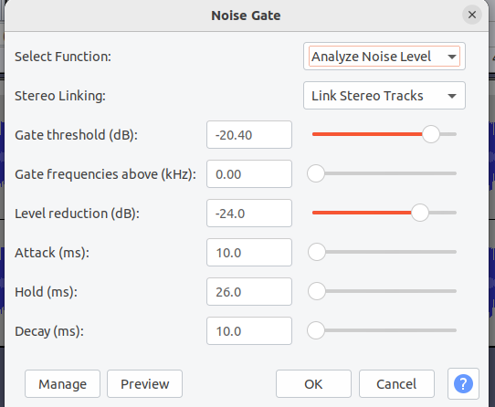

# happy-path

[Episode 64](https://anchor.fm/happypathprogramming/episodes/64-Building-Build-Tools-is-Hard-with-Josh-Suereth-e1lildd)  had an distracting echo from Josh Suereth track, so this is a first attempt of cleaning up.
These are snippets from 4:20 to 5:44 in the podcast.

Tool:Audacity

Plugin: Noise Gate

This is my first time using Audacity and I am sure I can reduce the slight choppyness in the processed file.
